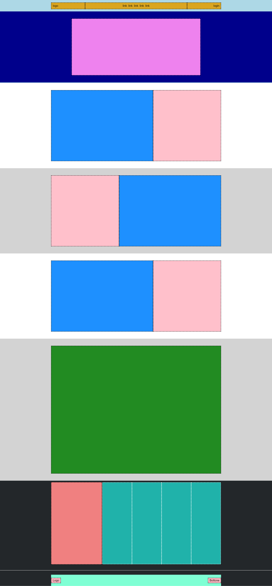

# Struttura Discord

Questo progetto consiste nella riproduzione del layout di un sito web esistente, Discord. L'obiettivo principale è quello di creare una struttura di base del sito utilizzando blocchi colorati e elementi di layout, senza inserire contenuti reali come testi, immagini, o dettagli specifici.

## Descrizione esercizio

- Layout Generale: Iniziamo identificando il layout generale del sito Discord. Questo comprende l'intestazione, il menu di navigazione, il pannello di chat, e altre sezioni chiave.

- Approccio dall'Alto verso il Basso: Seguiamo un approccio strutturato, partendo dall'alto verso il basso. Ci concentreremo sulla struttura di ogni sezione, garantendo che funzioni correttamente prima di passare alla successiva.

- Debugging: Ricordiamo che altezze e bordi sono elementi di "debugging" che verranno utilizzati per ottenere la giusta formattazione. L'altezza degli elementi sarà determinata dal contenuto effettivo una volta inserito.

## Obiettivo Finale

Una volta completato questo esercizio, avremo una base solida per il layout del sito Discord. Successivamente, potremo aggiungere contenuti reali, stili e dettagli per ottenere una riproduzione fedele del sito.

## Layout di riferimento



## Struttura

```bash
.
├── index.html
│
├── css/
│   └── style.css
│
├── img/
│   └── discord_blocks.png
│
└── README.md
```
